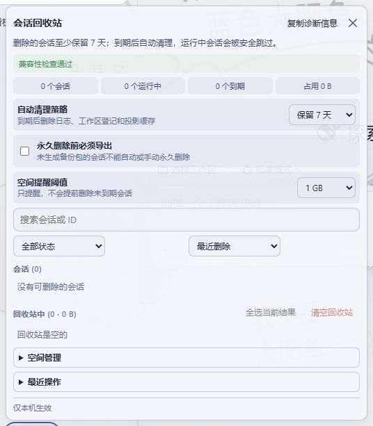
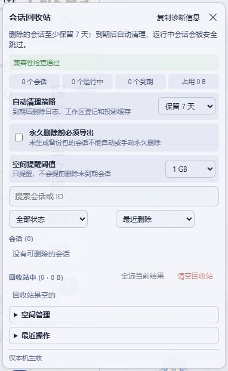
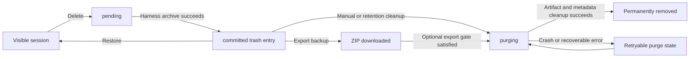

<div align="center">

# DSH Session Trash

**A crash-safe, recoverable session trash bin for the DeepSeek Harness Web UI.**

[](https://github.com/Wzs010429/dsh-session-trash/releases/latest)
[](https://github.com/Wzs010429/dsh-session-trash/actions/workflows/ci.yml)
[](LICENSE)


**English** | [简体中文](README.zh-CN.md)

</div>

DSH Session Trash adds the session lifecycle controls that DeepSeek Harness does not currently expose: recoverable deletion, guarded permanent cleanup, batch operations, ZIP backup export, retention policies, storage visibility, and compatibility diagnostics.

It integrates with the existing Harness Workspace instead of replacing it. Sessions are hidden through Harness' archive mechanism, remain recoverable, and only enter physical deletion through a crash-safe transaction.

> [!IMPORTANT]
> Designed and tested for the DSH `0.1.0-rc.x` web profile. The plugin intentionally fails toward data preservation when a Harness internal API, artifact path, or liveness check is unavailable.

## Interface

| Desktop | Mobile |
| --- | --- |
|  |  |

The screenshots use a Chinese-localized Harness instance. The plugin ships complete English and Simplified Chinese UI dictionaries and follows the active Harness locale and theme.

## Highlights

- **Delete without immediate data loss** — move a session to trash from its `...` menu or the footer panel, then undo or restore it later.
- **Crash-safe cleanup** — durable `pending -> committed -> purging` states prevent incomplete deletes from becoming irreversible or falsely restorable.
- **Optional subagent cascade** — include uninterrupted `origin: subagent` descendants while ordinary forks remain untouched; restore the batch from any surviving member.
- **Retention policies** — clean on shutdown, retain for 7 or 30 days, or keep forever. Running sessions remain protected during runtime cleanup.
- **Batch management** — filter, sort, select, restore, export, or permanently delete multiple sessions.
- **ZIP backup export** — export one session or a cascade batch before deletion; optionally require a successful export before any permanent cleanup.
- **Storage management** — see known/unknown usage, largest sessions, expired sessions, and optional 1/5/10 GB warning thresholds.
- **Private activity history** — retain up to 200 metadata-only events without copying conversation content.
- **Native presentation** — follows Harness light/dark theme tokens and remains usable on desktop and mobile.
- **Compatibility diagnostics** — verify the host capabilities used by the plugin and copy a support-ready diagnostic report.

## How It Works



Soft deletion uses `workspaceRegistry.archiveSession()`, so the existing Workspace grouping and search behavior hide the session consistently across tabs. Restore writes through the registry's own operation queue. Permanent cleanup removes the guarded session artifact, Workspace accounting, and projection-cache row through one idempotent transaction.

See [DESIGN.md](DESIGN.md) for the state machine, internal seams, path guards, and failure handling.

## Quick Start

### Requirements

- DeepSeek Harness with the `web` profile
- Node.js 20 or newer
- DSH `0.1.0-rc.x` is the currently validated series

### Install from source

```sh
git clone https://github.com/Wzs010429/dsh-session-trash.git
cd dsh-session-trash
dsh plugin --profile web add .
dsh web
```

Open the URL printed by `dsh web`. A **Trash** action appears in the sidebar footer, and unique-title session `...` menus gain **Delete this session**.

### Upgrade

```sh
git pull --ff-only
dsh plugin --profile web add .
# Restart dsh web
```

### Uninstall

```sh
dsh plugin --profile web remove @dsh-external/dsh-session-trash
# Restart dsh web
```

Uninstalling the plugin does not intentionally delete trashed artifacts. If recoverable entries remain, restore or permanently clean them before uninstalling so they do not remain archived without the plugin UI.

## Usage

### Move a session to trash

1. Open a session's `...` menu and select **Delete this session**, or open **Trash** in the sidebar footer.
2. Review the confirmation. If subagent descendants are detected, choose the current session only or the cascade batch.
3. Acknowledge the retention consequence and confirm.
4. Use the seven-second **Undo** action or restore the session later from the trash panel.

The current-session-only choice is always the default. Running sessions may continue in the background after being hidden, but they cannot be permanently deleted at runtime.

### Find and manage trashed sessions

- Search by title, full session ID, or workspace name.
- Filter by stopped, running, expired, unknown-size, or cleanup-failed state.
- Sort by deletion time, artifact size, expiry time, or name.
- Select the current result set, then restore, export, or permanently delete eligible entries in bulk.
- A cascade batch restores as a unit even when restoration starts from one member.

### Export a backup

Select **Export backup** on a row or use **Export selected**. The generated ZIP contains the available session artifact files plus `session-trash-export.json` with export metadata.

The browser download path currently has a **512 MiB per-export limit**. Oversized exports are refused before the manifest is marked as exported; the original session remains recoverable.

Enable **Require export before deletion** to block manual, scheduled, and shutdown cleanup until a backup has been generated. A crash-interrupted `purging` transaction still resumes, because physical deletion has already started at that point.

### Configure retention

| Policy | Behavior |
| --- | --- |
| **On shutdown** | Default. Recoverable until a normal `dsh web` shutdown, then eligible entries are permanently cleaned. |
| **Keep 7 days** | Retain for at least seven days; check after startup, hourly, and during normal shutdown. |
| **Keep 30 days** | Retain for at least thirty days with the same safety checks. |
| **Keep forever** | Never start a new automatic purge. Restore or delete manually. |

The panel displays the remaining time for finite policies. Runtime cleanup skips loaded sessions and retries later.

### Manage storage

- Review total known usage, unknown-size count, and the three largest sessions.
- Configure an optional **1 GB**, **5 GB**, or **10 GB** warning threshold.
- Clean only expired eligible sessions or all stopped eligible sessions.
- Warning thresholds never shorten the configured retention period and never delete data by themselves.

### Diagnose compatibility

The panel checks archive, restore, artifact discovery, liveness protection, runtime metadata cleanup, and HTTP route availability. Select **Copy diagnostics** to capture the plugin version, schema versions, capability results, current settings, and trash statistics.

## Safety Model

| Boundary | Guarantee |
| --- | --- |
| **Path safety** | Physical removal is restricted to absolute targets beneath the DSH sessions root; symbolic links are not recursively followed. |
| **Running sessions** | Immediate purge refuses sessions still loaded by the Harness session service. |
| **Unknown state** | Unreadable artifacts, missing host services, and broken liveness checks preserve data instead of authorizing deletion. |
| **Crash recovery** | `pending` entries stay recoverable; `purging` entries are never offered as safely restorable and are retried idempotently. |
| **Backup gate** | When enabled, unexported committed entries are blocked from manual, scheduled, and shutdown purge. |
| **Audit privacy** | History stores operation metadata only: type, timestamp, session IDs, result, counts, and byte totals. |
| **Cross-tab consistency** | Harness archive broadcasts control visibility; `BroadcastChannel` invalidates plugin state so every tab reloads the host manifest. |

## Local Data

The plugin uses files below the active `DSH_HOME`:

| File | Purpose |
| --- | --- |
| `storages/session-trash.json` | Crash-safe trash transaction manifest. Removed when the trash becomes empty. |
| `storages/session-trash-settings.json` | Versioned retention, export-gate, and storage-warning settings. |
| `storages/session-trash-audit.json` | Up to 200 metadata-only activity events. |
| `sessions/.../<session-id>/` | Original Harness session artifacts. The plugin does not relocate them during soft deletion. |

## Compatibility and Limitations

- The plugin depends on DSH `workspaceRegistry.enqueueOperation()`, `setState()`, service injection names, and archive-change broadcasting. Diagnostics make these dependencies visible, but a future Harness release may require an adapter update.
- The session-row `...` menu has no public third-party extension point. The plugin uses semantic `treeitem/menu/menuitem` DOM roles and safely falls back to the footer panel if those semantics change.
- Duplicate visible titles are not enhanced in the `...` menu because title-to-ID mapping would be ambiguous. Use the full trash panel instead.
- Soft deletion does not stop running sessions or subagents.
- Optional persistent `session-query-sqlite` full-text indexes are not modified because DSH exposes no public row-deletion API.
- Artifact size is a short-lived snapshot and may change while a background process is still writing.
- Force termination or power loss does not start a new purge; a purge that already reached `purging` resumes on the next safe cleanup opportunity.

## Development

```sh
npm run build:client
npm test
npm pack --dry-run
```

`lib/panel.code.js` is the browser source fragment. `npm run build:client` stitches it into the publishable `lib/client.js`. CI runs the build, complete fixture and mocked-host test suite, syntax checks, and package dry run on Node.js 20 and 22.

See [CHANGELOG.md](CHANGELOG.md) for release history. Bug reports and compatibility findings are welcome in [GitHub Issues](https://github.com/Wzs010429/dsh-session-trash/issues).

## Contributing

Keep changes narrow, preserve the fail-safe deletion boundaries, update `lib/panel.code.js` rather than editing only the generated bundle, and add a regression assertion for host or browser behavior. Run the full validation commands before opening a pull request.

## License

[MIT](LICENSE)
