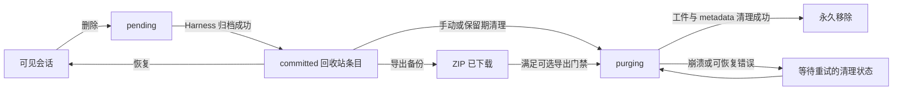

<div align="center">

# DSH Session Trash

**DeepSeek Harness Web UI 的崩溃安全、可恢复会话回收站。**

[](https://github.com/Wzs010429/dsh-session-trash/releases/latest)
[](https://github.com/Wzs010429/dsh-session-trash/actions/workflows/ci.yml)
[](LICENSE)


[English](README.md) | **简体中文**

</div>

DSH Session Trash 为 DeepSeek Harness 补充当前尚未公开的完整会话生命周期控制：可恢复删除、受保护的永久清理、批量操作、ZIP 备份、保留期、空间管理和兼容诊断。

插件复用现有 Harness Workspace，不替换官方界面。会话通过 Harness 归档机制隐藏并保持可恢复，只有经过崩溃安全事务后才会进入物理删除。

> [!IMPORTANT]
> 当前针对 DSH `0.1.0-rc.x` 的 web profile 设计和验证。Harness 内部接口、工件路径或运行状态无法可靠确认时，插件始终向“保留数据”的方向失败。

## 产品界面

| 桌面端 | 移动端 |
| --- | --- |
|  |  |

截图来自真实运行中的中文 Harness。插件同时提供完整英文与简体中文 UI，并跟随 Harness 当前语言和主题。

## 主要能力

- **删除不等于立刻丢失数据**：从会话 `...` 菜单或侧边栏面板移入回收站，随后可撤销或恢复。
- **崩溃安全清理**：持久化 `pending -> committed -> purging` 状态，防止未完成删除变成不可逆状态或提供虚假恢复。
- **可选子代理级联**：仅沿连续的 `origin: subagent` 后代传播，普通 fork 保持不变；可从任一剩余成员整批恢复。
- **保留策略**：关闭时清理、保留 7 天、保留 30 天或永久保留；运行期清理始终保护正在加载的会话。
- **批量管理**：筛选、排序、多选恢复、导出或永久删除。
- **ZIP 备份**：导出单个会话或整批级联会话；可要求成功导出后才允许任何永久清理。
- **空间管理**：显示已知/未知占用、最大会话、到期会话以及可选的 1/5/10 GB 提醒阈值。
- **隐私受限的操作历史**：最多保留 200 条 metadata 事件，不复制会话正文。
- **原生界面适配**：跟随 Harness 浅色/深色主题变量，桌面和移动端均可用。
- **兼容诊断**：检查插件依赖的 host 能力，并一键复制可用于排障的诊断信息。

## 工作原理



软删除调用 `workspaceRegistry.archiveSession()`，因此官方 Workspace 分组和搜索会在所有标签页一致隐藏该会话。恢复通过注册表自身的操作队列写回。永久清理在同一幂等事务中删除受路径守卫保护的会话工件、Workspace 登记和投影缓存行。

状态机、内部接口、路径守卫和失败处理详见 [DESIGN.md](DESIGN.md)。

## 快速开始

### 环境要求

- 带 `web` profile 的 DeepSeek Harness
- Node.js 20 或更高版本
- 当前已验证的 DSH 系列为 `0.1.0-rc.x`

### 从源码安装

```sh
git clone https://github.com/Wzs010429/dsh-session-trash.git
cd dsh-session-trash
dsh plugin --profile web add .
dsh web
```

打开 `dsh web` 输出的地址。侧边栏底部会出现“回收站”，标题唯一的会话 `...` 菜单会增加“删除当前会话”。

### 更新

```sh
git pull --ff-only
dsh plugin --profile web add .
# 重启 dsh web
```

### 卸载

```sh
dsh plugin --profile web remove @dsh-external/dsh-session-trash
# 重启 dsh web
```

卸载不会主动删除回收站中的会话工件。如果仍有可恢复条目，建议先恢复或永久清理，避免条目保持归档但失去插件管理界面。

## 使用说明

### 把会话移入回收站

1. 打开会话的 `...` 菜单并选择“删除当前会话”，或打开侧边栏底部“回收站”。
2. 检查确认信息。检测到子代理后代时，可只删除当前会话或选择级联批次。
3. 确认保留策略后勾选知情选项并提交。
4. 使用七秒内的“撤销”，或者之后在回收站面板恢复。

默认始终只选择当前会话。正在运行的会话被隐藏后可能继续在后台执行，但运行期不能被永久清理。

### 查找和批量管理

- 按标题、完整 session ID 或工作区名称搜索。
- 按已停止、运行中、已到期、大小未知或清理失败筛选。
- 按删除时间、工件大小、到期时间或名称排序。
- 全选当前结果后，批量恢复、导出或永久删除符合条件的条目。
- 级联批次从任一成员发起恢复时仍按整批恢复。

### 导出备份

点击单项“导出备份”或使用“批量导出”。ZIP 包含当前可用的会话工件文件以及记录导出信息的 `session-trash-export.json`。

浏览器下载路径目前有 **单次 512 MiB 上限**。超出上限会在清单标记导出成功之前明确拒绝，原会话保持完整可恢复。

开启“永久删除前必须导出”后，未生成备份的条目不能被手动、定时或关停清理。已经进入 `purging` 的崩溃中断事务仍会续跑，因为物理删除在开启新策略前已经开始。

### 设置保留期

| 策略 | 行为 |
| --- | --- |
| **关闭时清理** | 默认。正常关闭 `dsh web` 前可恢复，关停时永久清理符合条件的条目。 |
| **保留 7 天** | 至少保留七天；启动后、每小时和正常关停时检查。 |
| **保留 30 天** | 至少保留三十天，并应用同样的安全检查。 |
| **永久保留** | 不启动新的自动清理，只能恢复或手动永久删除。 |

有限保留策略会在面板显示剩余时间。运行期清理跳过已加载会话并在之后重试。

### 管理空间

- 查看已知总占用、未知大小数量和占用最大的三个会话。
- 设置可选的 **1 GB**、**5 GB** 或 **10 GB** 提醒阈值。
- 仅清理已到期且符合条件的会话，或清理全部已停止且符合条件的会话。
- 提醒阈值不会缩短保留期，也不会自行删除数据。

### 兼容诊断

面板会检查归档、恢复、工件定位、运行状态保护、运行时 metadata 清理和 HTTP 路由。点击“复制诊断信息”可获得插件版本、schema 版本、能力结果、当前设置和回收站统计。

## 安全模型

| 边界 | 保证 |
| --- | --- |
| **路径安全** | 物理删除只允许 sessions 根目录下的绝对路径；不会递归跟随符号链接。 |
| **运行中会话** | Harness session service 仍加载的会话不能立即永久清理。 |
| **未知状态** | 工件不可读、host service 缺失或运行状态检查异常时保留数据，不授权删除。 |
| **崩溃恢复** | `pending` 条目保持可恢复；`purging` 条目不提供虚假恢复，只允许幂等续清理。 |
| **备份门禁** | 开启后，未导出的 `committed` 条目不能被手动、定时或关停清理。 |
| **审计隐私** | 历史只保存类型、时间、session ID、结果、数量和字节数。 |
| **跨标签页一致性** | Harness 归档广播控制显隐；`BroadcastChannel` 使各标签页重新读取 host 权威清单。 |

## 本地数据

插件在当前 `DSH_HOME` 下使用以下文件：

| 文件 | 用途 |
| --- | --- |
| `storages/session-trash.json` | 崩溃安全事务清单；回收站清空后自动移除。 |
| `storages/session-trash-settings.json` | 带版本的保留期、导出门禁和空间提醒设置。 |
| `storages/session-trash-audit.json` | 最多 200 条 metadata 操作事件。 |
| `sessions/.../<session-id>/` | Harness 原始会话工件；软删除阶段不会搬移。 |

## 兼容性与已知限制

- 插件依赖 DSH 的 `workspaceRegistry.enqueueOperation()`、`setState()`、service 注入名称和归档变更广播。诊断面板会暴露这些依赖，但未来 Harness 版本仍可能需要适配更新。
- 会话行 `...` 菜单没有公开的第三方扩展点。插件基于语义化 `treeitem/menu/menuitem` DOM role 增强；结构变化时安全退回侧边栏面板。
- 标题重复时不增强 `...` 菜单，避免标题映射到错误 ID；请使用完整回收站面板。
- 软删除不会停止仍在执行的会话或子代理。
- 可选的持久化 `session-query-sqlite` 全文索引不会被修改，因为 DSH 没有公开逐行删除 API。
- 工件大小是短时快照，后台仍写入时可能变化。
- 强制终止或断电不会启动新的物理删除；已进入 `purging` 的事务会在下一次安全清理时续跑。

## 开发与验证

```sh
npm run build:client
npm test
npm pack --dry-run
```

`lib/panel.code.js` 是浏览器源码片段，`npm run build:client` 将其拼接为可发布的 `lib/client.js`。CI 在 Node.js 20 和 22 上执行构建、完整夹具与 mock host 测试、语法检查和打包检查。

版本历史见 [CHANGELOG.md](CHANGELOG.md)。欢迎通过 [GitHub Issues](https://github.com/Wzs010429/dsh-session-trash/issues) 提交缺陷和兼容性信息。

## 参与贡献

请保持改动边界清晰，保留“安全失败”的删除原则，修改 `lib/panel.code.js` 而不是只改生成的 bundle，并为 host 或浏览器行为补充回归断言。提交 Pull Request 前请运行完整验证命令。

## 许可证

[MIT](LICENSE)
